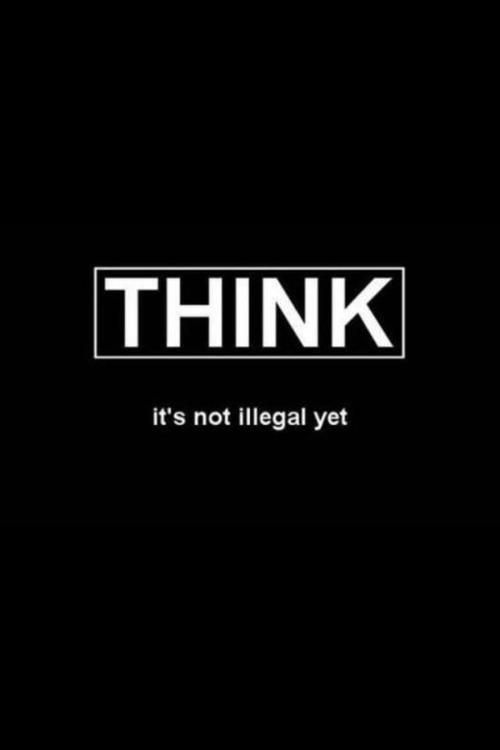

# [Introduction to Cybersecurity](https://en.wikipedia.org/wiki/Computer_security)

- Getting Started with [CEH( Certified Ethical Hacker)](https://www.eccouncil.org/train-certify/certified-ethical-hacker-ceh/)

- Getting Started with [OSCP( OffSec Certified Professional )](https://www.offsec.com/courses/pen-200/)

## Sources:

- [Ethical Hacking From Scratch - z Security](https://www.udemy.com/course/learn-ethical-hacking-from-scratch/)

- [Complete Ethical Hacking Bootcamp - Zero To Mastery](https://www.udemy.com/course/complete-ethical-hacking-bootcamp-zero-to-mastery/)

### [CompTIA Guide to Cybersecurity](https://www.comptia.org/blog/the-comptia-cybersecurity-career-pathway-employable-skills-found-here)

- [CompTIA Network+ (N10-008) Guide - Dion Training](https://www.udemy.com/course/comptia-network-n10-008/)

- [CompTIA Security+ (SY0-701) Guide - Dion Training](https://www.udemy.com/course/securityplus/)

- [CompTIA CySA+ (CS0-003) Guide - Dion Training](https://www.udemy.com/course/comptia-cysa-003/)

- [CompTIA Pentest+ Guide - Dion Training](https://www.udemy.com/course/pentestplus/)

...

...

## Some other sources:

- [KALI](https://www.kali.org/)

- [VulnHub](https://www.vulnhub.com/)

- [TryHackMe](https://tryhackme.com/)

- [HACKTHEBOX](https://www.hackthebox.com/)

## Until next time...

# ;)